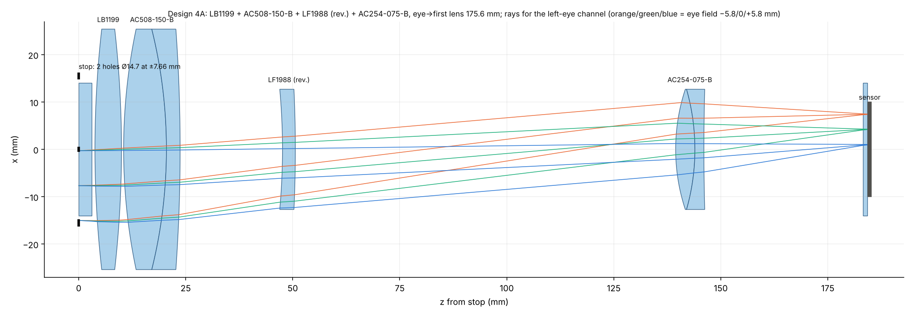
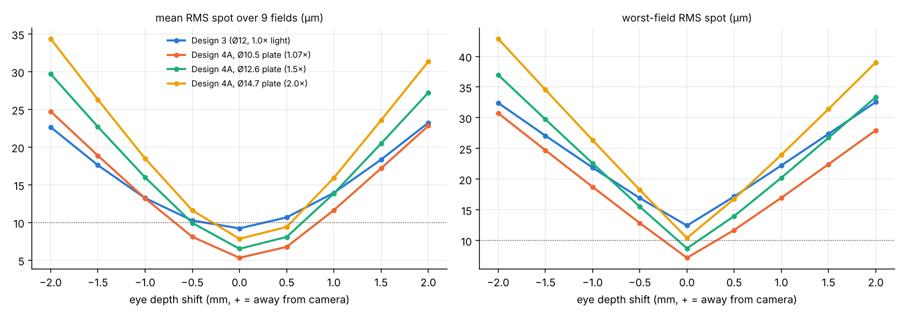

# Wide stock-lens search (2, 3 and 4 elements) — Design 4A

Goal of this round: search far more combinations of the Thorlabs stock list than the Design-3 search did, and find the
objective that collects the most light while keeping image quality at least as good as Design 3
(mean RMS ≤ 9.23 µm, worst field ≤ 12.6 µm, worst-field MTF@25 lp/mm ≥ 0.07, vignetting ≤ 10 %, m 0.53–0.59, image on the
sensor half). Same channel model as Design 3 (off-axis Ø-hole stop on the 3 mm filter, 9 fields 11.6 × 15.2 mm, 840/850/860 nm,
cover glass, same glass data and doublet splits), so the numbers compare one-to-one. Re-running Design 3 through the new
code gives exactly its published values (mean 9.22 µm, max 12.6 µm).

Scripts: `src/fastchan.py` (vectorised channel + paraxial), `src/search_wide.py` (screen), `src/refine_wide.py` (refine and
NA ladder), `src/final_wide.py` (multi-start NA push), `src/tol_depth.py`, `src/figure_wide.py`.
Library: three parts added to `src/stock.py` (LC1611, LD1170, LF1988). ½-inch parts and aspheres were not used
(too small for the 13–15 mm hole pair, and the AL prescriptions are not in the list).

## 1. Search

| Stage | What | Count |
|---|---|---|
| Screen, pairs | every ordered pair of 44 oriented elements | 1 936 (352 feasible) |
| Screen, triples | every ordered triple | 85 184 (26 787 feasible) |
| Screen, quads | one more element inserted anywhere into the 12 best triples | 1 124 |
| Refine | Nelder–Mead on stop gap, air gaps, eye distance (focus solved) at 1.44× Design-3 light | 225 |
| NA ladder + multi-start push | raise the stop NA in steps until a Design-3 criterion fails | 20 |

Screening solves the first-order layout in closed form (eye distance and sensor distance for m = 0.545 on a 13-value gap grid),
rejects layouts with eye→lens outside 150–205 mm, back focus outside 8–170 mm, edge contact or gross clipping, and ray-traces up to 20
grid points per configuration. "Light" below is collected solid angle × mean transmitted fraction, relative to Design 3.

## 2. Results (all meet the Design-3 image-quality limits at nominal eye position)

| Design | Elements (eye → camera) | Light vs D3 | Stop holes | Eye→lens | RMS mean / max (µm) | MTF25 min / mean | Vignetting | Parts cost |
|---|---|---|---|---|---|---|---|---|
| **4A** | **LB1199 + AC508-150-B + LF1988 (rev.) + AC254-075-B** | **2.04×** | Ø14.7 at ±7.66 | 175.6 mm | **7.8 / 10.4** | **0.25 / 0.55** | 5 % | ≈ $360 |
| 4B | AC508-150-B (rev.) + LA1979 (rev.) + LE1015 + AC254-075-B | 1.95× | Ø12.1 at ±6.5 | 150.0 | 9.0 / 10.7 | 0.24 / 0.50 | 0 % | ≈ $385 |
| 4C | AC508-150-B (rev.) + AC508-150-B + LF1988 (rev.) + AC254-050 | 1.91× | Ø12.4 | 168.0 | 6.6 / 12.3 | 0.16 / – | 5 % | ≈ $470 |
| **3B** | **LB1199 + AC254-150 + AC254-075-B** | **1.73×** | Ø11.7 at ±6.5 | 150.0 | 8.7 / 10.6 | 0.19 / 0.49 | 9 % | ≈ $250 |
| 3C | LB1294 + AC254-150 + AC254-075-B | 1.71× | Ø11.7 | 150.0 | 9.1 / 10.7 | 0.20 / – | 8 % | ≈ $235 |
| 3D | LBF254-200 (rev.) + AC254-150 + AC254-075-B | 1.68× | Ø11.7 | 150.0 | 8.1 / 11.0 | 0.30 / – | 10 % | ≈ $275 |
| Design 3 | LBF254-200 (rev.) + AC508-150-B + AC254-150 | 1.00× | Ø12 at ±6.5 | 199.3 | 9.2 / 12.6 | 0.07 / 0.44 | 8 % | ≈ $330 |

Pairs never reached Design-3 quality above 1.0× light. The common thread of the winners: a weak 2-inch (or 1-inch) positive
front element near the stop, then an AC254-075-B as the last, strong element. The extra light comes from two things: lower
aberrations at a given aperture, and the wider eye-distance window (150–205 mm instead of 195–205 mm), which lets the same
1- and 2-inch lenses accept a larger cone from the eye.
What limits the light further is vignetting in the 1-inch rear lenses (3-element designs) and the mean RMS (4-element designs).

## 3. Selected candidate: Design 4A

### Prescription (one channel, unfolded; z = 0 at the stop; mm) — same OpticStudio layout as `DESIGN3_ZEMAX.md`
| # | Item | Radius | Thickness | Glass | Semi-diam. |
|---|---|---|---|---|---|
| OBJ | eye plane (P1/P4 mid-plane) | inf | **171.759** | – | |
| 1 | CB | – | 0 | – | decenter X = −7.661 |
| 2 | STOP Ø14.72 (r 7.361) + filter | inf | 3.0 | N-BK7 proxy | |
| 3 | air | inf | **0.796** | – | |
| 4 | CB | – | 0 | – | decenter X = +7.661 (pick-up −1) |
| 5 | LB1199 (bi-convex, symmetric) | +205.0 | 6.2 | N-BK7 | 22.86 |
| 6 | | −205.0 | **0.500** | air | 22.86 |
| 7 | AC508-150-B, standard (crown first) | +112.2 | 10.0 | N-LAK22 | 22.86 |
| 8 | | −95.9 | 3.2 | N-SF6HT | 22.86 |
| 9 | | −325.1 | **23.912** | air | 22.86 |
| 10 | LF1988-A, **reversed** (catalogue 250.0 / 126.3) | −126.3 | 3.0 | N-BK7 | 11.43 |
| 11 | | −250.0 | **88.855** | air | 11.43 |
| 12 | AC254-075-B, standard | +36.90 | 4.5 | N-BAF10 | 11.43 |
| 13 | | −42.17 | 2.1 | N-SF6HT | 11.43 |
| 14 | | +417.8 | **37.216** | air | 11.43 |
| 15 | cover glass | inf | 1.0 | N-BK7 proxy | |
| 16 | gap to die | inf | 0.5 | – | |
| IMA | sensor | | | | |

Eye → first lens 175.6 mm; filter front → sensor 184.8 mm (Design 3: 262 mm); eye → sensor 356.5 mm (Design 3: 458 mm).
Folded: eye → M1 30, M1 → V **23.84** (= IPD/2 − 7.66 at IPD 63; 19.3–29.3 mm over IPD 54–74), V → stop **117.92 mm** (30 + 23.84 + 117.92 = 171.76). Stop holes Ø14.7 mm, 15.32 mm apart (0.6 mm web; a Ø14.3 plate gives a
1.0 mm web for 1.93× light). Image on each sensor half: x = 1.02–7.42 mm, m = 0.553 (18.1 µm per pixel in the eye).

### Performance
| Item | Design 4A (Ø14.7) | Design 3 |
|---|---|---|
| RMS spot by field (rows Y −7.6/0/+7.6; columns inner/centre/outer) | 10.4 5.7 7.9 / 6.1 6.0 10.4 / 10.4 5.7 7.9 | 12.6 5.7 8.1 / 6.7 11.1 12.5 / 12.6 5.7 8.1 |
| Working f/# | 7.2 | 10.2 |
| Monte Carlo, 60 builds (gaps ±0.2, decenter ±0.1 mm, EFL ±1 %, refocus), 90th percentile mean / max | 7.9 / 12.3 µm | 9.1 / 13.8 µm |
| Spot vs eye depth ±1 mm (mean) | 18.5 / 15.9 µm | 13.3 / 13.9 µm |

### One barrel, three stop plates
The lens spacing stays fixed; only the stop plate changes (holes stay at ±7.66 mm, refocus the camera by about 0.01 mm):

| Stop plate | Light vs D3 | RMS mean / max | MTF25 min / mean | Depth ±1 mm mean RMS | f/# |
|---|---|---|---|---|---|
| Ø10.5 | 1.07× | 5.3 / 7.2 | 0.44 / 0.61 | 13.2 / 11.7 (better than D3) | 10.1 |
| Ø12.6 | 1.53× | 6.5 / 8.7 | 0.36 / 0.59 | 16.0 / 13.9 | 8.4 |
| Ø14.7 | 2.04× | 7.8 / 10.4 | 0.25 / 0.55 | 18.5 / 15.9 | 7.2 |

Depth of field is set by geometry (blur grows with NA), so more light always costs depth tolerance. In a separate run
that also held Design 3's ±1 mm depth blur as a constraint, no layout got more than ~1.07× light; the gain there is
sharpness instead (MTF25 min 0.33–0.47 vs 0.07).

## 4. Model-eye simulation (P1/P4 detection and gaze)

**Correction to the earlier signal model.** `simulate_images.py` pinned the P1 *peak* to 9000 e⁻ and set the P4 *peak* to 1.2 % of
it. With that rule, a sharper P1 makes P4 dimmer (less total flux), so sharper optics are penalised; this is what made Design 3
"lose P4 at +1 mm". A flux model is now available (`FLUX_MODE=1 FLUX_E=83700`): fixed LED power, P4 flux = 1.2 % of P1 flux,
calibrated so Design 3 still has a 9000 e⁻ P1 peak at nominal depth, and collected flux ∝ (NA)² for the other designs.
The old mode stays the default for reproducibility.

P4 detection rate vs eye depth shift (27 noisy frames per point, focus at the P1/P4 mid-plane, no focus bias):

| Model / design | −2 | −1 | −0.5 | 0 | +0.5 | +1 | +2 mm |
|---|---|---|---|---|---|---|---|
| Flux, Design 3 | 100 % | 100 | 100 | 100 | 100 | 100 | 100 |
| Flux, 4A Ø14.7, same LED | 100 | 100 | 100 | 100 | 100 | 100 | 100 |
| Flux, 4A Ø14.7, LED × 0.49 (same signal as D3) | 67 | 100 | 100 | 100 | 100 | 100 | 19 |
| Flux, 4A Ø10.5 / Ø12.6 | 100 / 100 | 100 | 100 | 100 | 100 | 100 | 100 / 100 |
| Flux, 3B | 100 | 100 | 100 | 100 | 100 | 100 | 100 |
| Old peak model, 4A Ø14.7 | 100 | 100 | 100 | 93 | 15 | 59 | 100 |

P4 centroid error at ±2 mm: Design 3 0.5–0.6 px, 4A 0.6–1.0 px.
Gaze simulation (flux model, same LED; calibration 5×5 ±12°, test 7×7 ±15°):

| | Design 3 | Design 4A Ø14.7 |
|---|---|---|
| Gaze error RMS / max (±15°) | 0.118° / 0.32° | 0.110° / 0.27° |
| RMS inside ±12° | 0.049° | 0.047° |
| Precision (200 frames) | 0.007° | 0.006° (P1 saturates at full LED; lower the LED or exposure) |
| Gaze error at eye depth −2/−1/+1/+2 mm | 0.23/0.11/0.15/0.22° | 0.34/0.14/0.14/0.37° |
| Lateral eye shift ±0.5 mm | 0.05° | 0.07° |

## 5. Build notes for 4A (differences from `DESIGN3_BUILD.md`)
1. SM2 tube for LB1199 + AC508-150-B (they nearly touch at the centre: 0.5 mm vertex gap, ~4 mm at the rim — use a thin SM2 spacer
   ring at the rim, check with the vendor `.zmx` sag), SM2→SM1 adapter, then SM1 tube for LF1988 and AC254-075-B.
2. Orientation: LB1199 either way (symmetric); AC508-150-B crown (strongly curved R 112.2) toward the eye; **LF1988 reversed**
   (the R 126.3 face toward the eye, so the meniscus bows toward the camera); AC254-075-B R 36.9 face toward the eye.
3. Spacers: 23.9 mm (AC508 → LF1988) and 88.9 mm (LF1988 → AC254-075-B) vertex to vertex; camera ~37.2 mm behind the last vertex on a rail.
4. Stop plate on the filter, 0.8 mm before LB1199, two holes Ø14.7 at ±7.66 mm (or swap in Ø10.5 / Ø12.6 plates; same centres).
5. LF1988 is only stocked with the −A (visible) coating; at 850 nm each face reflects roughly like bare glass (~4 %). Check for a
   −B version or accept the small ghost; it sits far from the stop and the image.
6. Start at a lower LED power: at the same LED, 4A delivers about twice Design 3's signal and saturates P1.

## 6. Caveats
Same as the other documents: glass data typed from memory, doublet crown/flint splits assumed, filter and cover glass are
placeholders, AC508-150-B models 1 % long in EFL (catalogue tolerance), local optima, no OpticStudio check yet. The P4/P1 ratio
and noise model decide the absolute detection numbers; the comparison between designs is the meaningful part.
Check in OpticStudio with the vendor `.zmx` files before ordering (same procedure as `DESIGN3_ZEMAX.md`, step 1).
